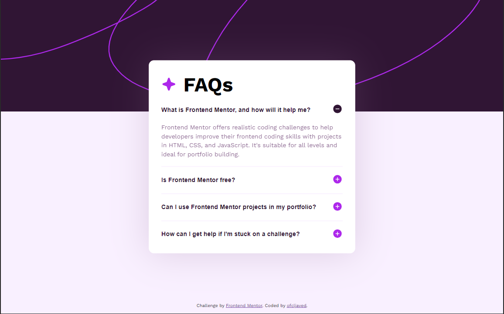

# Frontend Mentor - FAQ accordion solution

This is a solution to the [FAQ accordion challenge on Frontend Mentor](https://www.frontendmentor.io/challenges/faq-accordion-wyfFdeBwBz). Frontend Mentor challenges help you improve your coding skills by building realistic projects.

## Table of contents

- [Overview](#overview)
  - [The challenge](#the-challenge)
  - [Screenshot](#screenshot)
  - [Links](#links)
- [My process](#my-process)
  - [Built with](#built-with)``
  - [What I learned](#what-i-learned)
  - [Useful resources](#useful-resources)
- [Author](#author)

**Note: Delete this note and update the table of contents based on what sections you keep.**

## Overview

### The challenge

Users should be able to:

- Hide/Show the answer to a question when the question is clicked
- Navigate the questions and hide/show answers using keyboard navigation alone
- View the optimal layout for the interface depending on their device's screen size
- See hover and focus states for all interactive elements on the page

### Screenshot



### Links

- Solution URL: [https://github.com/ofcljaved/faq-accordion](https://github.com/ofcljaved/faq-accordion)
- Live Site URL: [https://faq-accordion-ofcljaved.vercel.app/](https://faq-accordion-ofcljaved.vercel.app/)

## My process

### Built with

- Semantic HTML5 markup
- CSS view-transition API
- CSS Grid
- Mobile-first workflow
- [Vite](https://vitejs.dev/) - Development library
- [TypeScript](https://www.typescriptlang.org/) - TypeScript
- [Kevin Powell](https://www.youtube.com/@KevinPowell) - Kevin Powell's Youtube

### What I learned

By doing this project I evaluated my developement skills and implemented new view transition api to animate from one view to another smoothly wihtout any hassel and involving any library. This project been a great help to implement and test my skills to it. And with the help of CSS grid it's easy to make layout without any extraa node and typescript assertions helps in error safety which is quite good.

```ts
//Browser support is not very great so have to use fallback here
if (!document.startViewTransition) {
  listItem.querySelector("p")?.removeAttribute("hidden");
}
document.startViewTransition(() => {
  listItem.querySelector("p")?.removeAttribute("hidden");
});
```

```ts
//can't gave them common view transition name otherwise everything will broke
accordionBtn.forEach((btn, idx) => {
  btn.addEventListener("click", handleEvent);
  let para = btn.nextElementSibling as HTMLParagraphElement;
  para.style.viewTransitionName = `accord-${++idx}`;
});
```

```css
::view-transition-group(root) {
  animation-duration: 150ms;
}
```

### Useful resources

- [View Transition code of Kevin Powell](https://codepen.io/kevinpowell/pen/GRzxybd/c5c073666a8225c2c8f2fadd4d7c049b?editors=1010) - This helped me for analyzing the transition.

## Author

- Website - [ofcljaved](https://ofcljaved.github.io/findjaved/)
- Frontend Mentor - [@Ofcl-Javed](https://www.frontendmentor.io/profile/Ofcl-Javed)
- Twitter - [@ofcljaved](https://www.twitter.com/ofcljaved)
